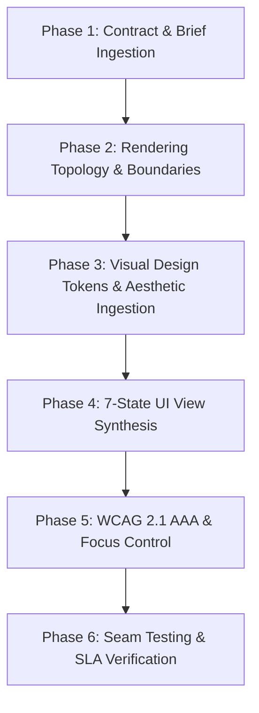

# Frontend Ship

Implement user-facing interface features from agreed briefs and API contracts through deterministic, accessible, and visual-first UI engineering.

The default target stack is **Next.js App Router (React Server Components & Client Components)**, **TypeScript 5+**, **CSS Custom Properties (Design Tokens)**, and **Playwright / Vitest** seam testing. Before writing code, inspect the local repository to inherit existing framework conventions, routing structures, styling systems, and test harnesses.

---

## 1. System Architecture & Deterministic Execution State Machine



### Execution Flow Protocol

#### Phase 1: Contract & Brief Ingestion
- Ingest `AGENTS.md`, design specifications, and typed backend API schemas.
- Identify missing backend routes, data attributes, or authorization requirements. State explicit assumptions before inventing server endpoints or client data shapes.

#### Phase 2: Rendering Topology & Boundaries
- Determine rendering placement for every component:
  - **Server Components (RSC)**: Data fetching, database access, heavy computations, sensitive business logic, and static markup.
  - **Client Components (`'use client'`)**: Event listeners (`onClick`, `onChange`), React state (`useState`, `useReducer`), browser APIs (`localStorage`, `window`), custom animation hooks, 3D tilt effects, and WebGL contexts.
- **Invariant**: Never import server-only modules or expose private environment variables (`DATABASE_URL`, `API_SECRET`) inside client-side bundles.

#### Phase 3: Visual Design Tokens & Aesthetic Ingestion
- Ingest visual design system primitives across four core aesthetic modes: **Minimalist**, **Expressive**, **Glassmorphic**, and **3D Spatial Depth**.
- **Invariant**: Ban generic browser defaults, plain red/blue/green colors, uncurated hex values (`#ff0000`), or arbitrary pixel font sizes (`font-size: 13px`).

#### Phase 4: 7-State UI View Synthesis
- Implement deterministic views for all 7 mandatory UI states:
  1. `INITIAL`: Idle baseline state before user interaction.
  2. `LOADING`: Skeleton loader fallbacks with `aria-busy="true"` and non-blocking layout shifts.
  3. `SUCCESS`: Interactive state displaying valid server data with semantic HTML landmarks.
  4. `EMPTY`: Actionable fallback state when dataset returns length $0$, offering clear next steps.
  5. `ERROR`: Non-sensitive, actionable error UI state with recovery controls.
  6. `RETRY`: Deterministic backoff execution and focus restoration on retry trigger.
  7. `PERMISSION_DENIED`: 403 / Unauthenticated fallback view prompting appropriate auth flows.

#### Phase 5: WCAG 2.1 AAA Accessibility & Focus Control
- Enforce full keyboard operability (`Tab`, `Shift+Tab`, `Enter`, `Space`, `Escape`, `Arrow` keys).
- Implement focus trap management inside modal overlays and ensure visible focus rings (`:focus-visible`).
- Provide live region announcements (`aria-live="polite"` / `aria-live="assertive"`) for dynamic updates.

#### Phase 6: Seam Testing, SLA Audit & Handoff
- Add behavior-focused tests at public component boundaries using Playwright or Vitest.
- Verify Core Web Vitals targets ($LCP < 1.2\text{s}$, $CLS < 0.05$, $INP < 100\text{ms}$).
- Update verification reports with changing UI routes, test execution commands, and handoff state artifacts.

---

## 2. Visual Design System Tokens & Aesthetics (Minimalist, Expressive, Glassmorphic, 3D)

All visual styling must consume structured design system tokens via CSS Custom Properties.

```css
/* Core Visual Design Tokens Contract */
:root {
  /* 1. Minimalist & Surface Color System (HSL Curated) */
  --color-bg-base: hsl(222, 47%, 10%);
  --color-surface-card: hsl(217, 33%, 15%);
  --color-surface-hover: hsl(217, 33%, 20%);
  --color-surface-active: hsl(217, 33%, 24%);
  --color-border-hairline: rgba(255, 255, 255, 0.08);
  --color-border-subtle: hsl(217, 24%, 27%);
  --color-text-primary: hsl(210, 40%, 98%);
  --color-text-secondary: hsl(215, 20%, 65%);
  --color-text-muted: hsl(215, 15%, 45%);

  /* 2. Expressive Brand & Aurora Glow Gradients */
  --color-brand-primary: hsl(210, 100%, 56%);
  --color-brand-hover: hsl(210, 100%, 48%);
  --color-brand-accent: hsl(270, 95%, 65%);
  --gradient-brand-primary: linear-gradient(135deg, hsl(210, 100%, 56%) 0%, hsl(270, 95%, 65%) 100%);
  --gradient-aurora-glow: radial-gradient(circle at 50% 0%, rgba(59, 130, 246, 0.25) 0%, rgba(147, 51, 234, 0.15) 50%, transparent 100%);
  --gradient-surface-shine: linear-gradient(180deg, rgba(255, 255, 255, 0.07) 0%, rgba(255, 255, 255, 0.01) 100%);

  /* 3. Glassmorphism & Depth System */
  --glass-bg: rgba(23, 32, 54, 0.55);
  --glass-bg-hover: rgba(30, 41, 68, 0.68);
  --glass-border: 1px solid rgba(255, 255, 255, 0.12);
  --glass-border-glow: 1px solid rgba(147, 51, 234, 0.35);
  --glass-backdrop: blur(16px) saturate(180%);
  --glass-backdrop-heavy: blur(24px) saturate(200%);

  /* Multi-Layered Elevation Shadows */
  --elevation-sm: 0 2px 4px rgba(0, 0, 0, 0.2);
  --elevation-md: 0 8px 16px -2px rgba(0, 0, 0, 0.3), 0 4px 8px -2px rgba(0, 0, 0, 0.2);
  --elevation-lg: 0 20px 30px -5px rgba(0, 0, 0, 0.4), 0 10px 15px -5px rgba(0, 0, 0, 0.25);
  --elevation-glass: 0 8px 32px 0 rgba(0, 0, 0, 0.37), inset 0 1px 0 0 rgba(255, 255, 255, 0.15);
  --elevation-glow-brand: 0 0 25px -5px rgba(59, 130, 246, 0.4);

  /* 4. Fluid Typography Scale */
  --font-family-base: 'Inter', system-ui, -apple-system, sans-serif;
  --font-size-xs: clamp(0.75rem, 0.7rem + 0.25vw, 0.875rem);
  --font-size-sm: clamp(0.875rem, 0.8rem + 0.35vw, 1rem);
  --font-size-md: clamp(1rem, 0.9rem + 0.5vw, 1.25rem);
  --font-size-lg: clamp(1.25rem, 1.1rem + 0.75vw, 1.75rem);
  --font-size-xl: clamp(1.75rem, 1.4rem + 1.25vw, 2.5rem);

  /* Spacing Scale */
  --space-1: 0.25rem;
  --space-2: 0.5rem;
  --space-3: 0.75rem;
  --space-4: 1rem;
  --space-6: 1.5rem;
  --space-8: 2rem;
  --space-12: 3rem;

  /* Border Radii */
  --radius-sm: 0.375rem;
  --radius-md: 0.5rem;
  --radius-lg: 0.875rem;
  --radius-full: 9999px;

  /* Spring Physics & Micro-Animation Curves */
  --ease-spring: cubic-bezier(0.16, 1, 0.3, 1);
  --ease-bounce: cubic-bezier(0.34, 1.56, 0.64, 1);
  --duration-fast: 150ms;
  --duration-normal: 250ms;
  --duration-slow: 400ms;
}

/* Glassmorphic Card Utility Class */
.glass-card {
  background: var(--glass-bg);
  backdrop-filter: var(--glass-backdrop);
  -webkit-backdrop-filter: var(--glass-backdrop);
  border: var(--glass-border);
  box-shadow: var(--elevation-glass);
  border-radius: var(--radius-lg);
  transition: transform var(--duration-normal) var(--ease-spring),
              background var(--duration-normal) var(--ease-spring),
              box-shadow var(--duration-normal) var(--ease-spring);
}

.glass-card:hover {
  background: var(--glass-bg-hover);
  transform: translateY(-3px) scale(1.01);
  box-shadow: var(--elevation-lg), var(--elevation-glow-brand);
}

/* 3D Perspective Card Container */
.card-3d-wrapper {
  perspective: 1000px;
}

.card-3d-inner {
  transform-style: preserve-3d;
  transition: transform var(--duration-normal) var(--ease-spring);
}

.card-3d-inner:hover {
  transform: rotateX(4deg) rotateY(-4deg) translateZ(10px);
}
```

---

## 3. Reference Implementation: 7-State Accessible Glassmorphic & 3D Component Pattern

```tsx
'use client';

import React, { useState, useEffect, useRef } from 'react';

export type UIViewState = 'INITIAL' | 'LOADING' | 'SUCCESS' | 'EMPTY' | 'ERROR' | 'RETRY' | 'PERMISSION_DENIED';

interface DataRecord {
  id: string;
  title: string;
  category: string;
  metric: string;
}

interface ComponentProps {
  apiEndpoint: string;
  authToken?: string;
}

export function ExpressiveFeatureContainer({ apiEndpoint, authToken }: ComponentProps) {
  const [viewState, setViewState] = useState<UIViewState>('INITIAL');
  const [data, setData] = useState<DataRecord[]>([]);
  const [errorMessage, setErrorMessage] = useState<string>('');
  const retryButtonRef = useRef<HTMLButtonElement>(null);

  const fetchData = async () => {
    if (!authToken) {
      setViewState('PERMISSION_DENIED');
      return;
    }

    setViewState('LOADING');
    try {
      const response = await fetch(apiEndpoint, {
        headers: {
          Authorization: `Bearer ${authToken}`,
          'Content-Type': 'application/json',
        },
      });

      if (response.status === 401 || response.status === 403) {
        setViewState('PERMISSION_DENIED');
        return;
      }

      if (!response.ok) {
        throw new Error(`Server responded with status ${response.status}`);
      }

      const result: DataRecord[] = await response.json();
      if (!Array.isArray(result) || result.length === 0) {
        setData([]);
        setViewState('EMPTY');
      } else {
        setData(result);
        setViewState('SUCCESS');
      }
    } catch (err: any) {
      setErrorMessage(err.message || 'An unexpected error occurred.');
      setViewState('ERROR');
    }
  };

  useEffect(() => {
    fetchData();
  }, [apiEndpoint, authToken]);

  useEffect(() => {
    if (viewState === 'ERROR' && retryButtonRef.current) {
      retryButtonRef.current.focus();
    }
  }, [viewState]);

  return (
    <section className="glass-card card-3d-wrapper" aria-live="polite" aria-busy={viewState === 'LOADING'}>
      <div className="card-3d-inner p-6">
        {viewState === 'INITIAL' && (
          <div className="state-view state-idle">
            <p className="text-muted">Initializing interactive view...</p>
          </div>
        )}

        {viewState === 'LOADING' && (
          <div className="state-view state-skeleton" role="status" aria-label="Loading content">
            <div className="skeleton-line header-skeleton" />
            <div className="skeleton-line body-skeleton" />
            <div className="skeleton-line body-skeleton short" />
          </div>
        )}

        {viewState === 'PERMISSION_DENIED' && (
          <div className="state-view state-denied" role="alert">
            <h3 className="text-gradient">Access Restricted</h3>
            <p>Authentication token required to render this dataset.</p>
          </div>
        )}

        {viewState === 'EMPTY' && (
          <div className="state-view state-empty">
            <h3>No Records Available</h3>
            <p>Your filter returned zero records. Create a record to begin.</p>
          </div>
        )}

        {viewState === 'ERROR' && (
          <div className="state-view state-error" role="alert">
            <h3 className="text-error">Unable to Sync View</h3>
            <p>{errorMessage}</p>
            <button
              ref={retryButtonRef}
              onClick={() => {
                setViewState('RETRY');
                fetchData();
              }}
              className="btn-primary-gradient"
            >
              Retry Connection
            </button>
          </div>
        )}

        {viewState === 'SUCCESS' && (
          <ul className="record-grid" aria-label="Feature data records">
            {data.map((item) => (
              <li key={item.id} className="record-card-glass">
                <span className="record-title">{item.title}</span>
                <span className="record-badge-glow">{item.category}</span>
                <span className="record-metric">{item.metric}</span>
              </li>
            ))}
          </ul>
        )}
      </div>
    </section>
  );
}
```

---

## 4. Playwright Public-Seam Browser Test Pattern

```typescript
import { test, expect } from '@playwright/test';

test.describe('ExpressiveFeatureContainer E2E & Seam Assertions', () => {
  test('should display glassmorphic card and transition to success view', async ({ page }) => {
    await page.route('/api/records', async (route) => {
      await route.fulfill({
        status: 200,
        contentType: 'application/json',
        body: JSON.stringify([
          { id: '1', title: 'Aurora Engine', category: 'Core', metric: '99.9%' },
          { id: '2', title: 'Glassmorphic UI', category: 'Frontend', metric: '60 FPS' },
        ]),
      });
    });

    await page.goto('/dashboard/features');

    const card = page.locator('.glass-card');
    await expect(card).toBeVisible();

    const recordItems = page.locator('.record-card-glass');
    await expect(recordItems).toHaveCount(2);
    await expect(recordItems.first()).toContainText('Aurora Engine');
  });

  test('should handle permission denied 403 fallback gracefully', async ({ page }) => {
    await page.route('/api/records', async (route) => {
      await route.fulfill({ status: 403 });
    });

    await page.goto('/dashboard/features');

    const alertView = page.locator('.state-denied');
    await expect(alertView).toBeVisible();
    await expect(alertView).toContainText('Access Restricted');
  });
});
```

---

## 5. Core Web Vitals & SLA Performance Mathematics

$$LCP = \min(\{t_{\text{load}}(e) \mid e \in \text{DOM Elements}\}) < 1.2\text{s}$$

$$CLS = \sum_{i} (\text{Impact Fraction}_i \times \text{Distance Fraction}_i) < 0.05$$

$$INP = \text{P98}(\{t_{\text{input\_response}}(e) \mid e \in \text{Interactions}\}) < 100\text{ms}$$

$$\text{Initial Bundle Size} = \sum \text{JS Client Chunks} < 50\text{KB (gzip)}$$

---

## 6. Security, Sanitization & Boundary Guardrails

- **Zero Credential Exposure**: Never expose private API keys (`STRIPE_SECRET_KEY`, `DATABASE_PASSWORD`) in client-side bundles or `NEXT_PUBLIC_` environment variables.
- **XSS Prevention**: Never bypass React DOM escaping with `dangerouslySetInnerHTML` unless input is sanitized through a verified library (e.g. DOMPurify).
- **Untrusted Input Boundaries**: Parse all URL parameters, form data, and API payloads through typed Zod or Pydantic schemas before mutating state.
- **CSRF & SameSite Cookies**: Ensure all mutating form submissions transmit SameSite=Strict cookies and CSRF tokens.

---

## 7. I/O Context Schema & Environment vs. Framework Dependency Matrix

| Variable / Parameter | Type | Schema / Format | Description | Dependency Classification |
| :--- | :--- | :--- | :--- | :--- |
| `API_ENDPOINT` | `string` | `https://*` or `/api/*` | Target REST or GraphQL endpoint URL for feature data fetching. | **Environment-Dependent** |
| `AUTH_TOKEN` | `string` | JWT / Bearer string | Active user authentication token passed in request headers. | **Environment-Dependent** |
| `VIEW_STATE` | `string` | `INITIAL` \| `LOADING` \| `SUCCESS` \| `EMPTY` \| `ERROR` \| `RETRY` \| `PERMISSION_DENIED` | Active component state driving conditional rendering views. | **Framework-Dependent** |
| `DESIGN_TOKENS` | `object` | CSS Custom Properties | Minimalist, Expressive, Glassmorphism, and 3D depth visual tokens. | **Framework-Dependent** |
| `CORE_WEB_VITALS_SLA` | `object` | LCP < 1.2s, CLS < 0.05, INP < 100ms | Mathematical latency and layout shift performance targets. | **Framework-Dependent** |

---

## 8. Verification Plan & CI Commands

Execute the following verification suite after modifying or updating any frontend features:

```bash
# 1. Validate repository content invariants and SKILL.md frontmatter
python3 scripts/validate_content.py

# 2. Rebuild Cursor rules and Catalog inventories
python3 scripts/build_cursor_rules.py --skills-dir skills --out-dir .cursor/rules
python3 scripts/generate_catalog.py
python3 scripts/diff_catalog.py

# 3. Validate zero-trust RBAC catalog rules
python3 scripts/validate_rbac_schema.py --target-dir .

# 4. Execute unit test discovery suite
python3 -m unittest discover -s tests -v
```
